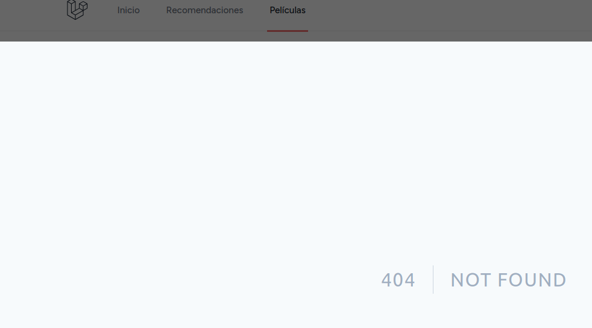
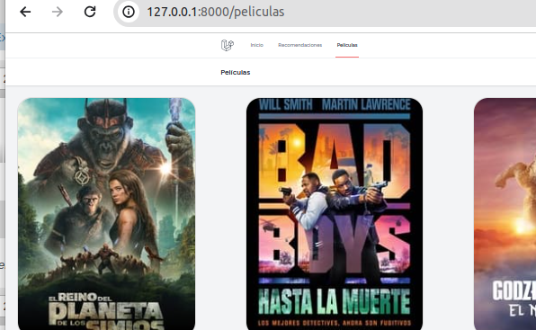

## levantar
* He creado un **docker-compose.yaml** para levantar el proyecto
* Esto no devería de afectar para nada a su funcionamiento
* 
>Acciones=>
> * he creado docker-compose.yaml y .env
> * he quitado sail de composer.json para que no se instalara al hacer **composer update**

## Poner en funcionamiento
1.- Ejecuto las migraciones
2.- Levanto el cliente
Obtento este error:
➜  APP_URL: http://localhost

>Error: The following dependencies are imported but could not be resolved:
>
>@inertiajs/inertia (imported by /home/manuel/laravel/friendflix/resources/js/Pages/PopularMovies/Index.jsx)
>
>Are they installed?
>at file:///home/manuel/laravel/friendflix/node_modules/vite/dist/node/chunks/dep-cNe07EU9.js:52538:23
>at process.processTicksAndRejections (node:internal/process/task_queues:95:5)
>at async file:///home/manuel/laravel/friendflix/node_modules/vite/dist/node/chunks/dep-cNe07EU9.js:52004:38

Parece que es porque falta un paquete en front, lo instalo
```bash
 npm install @inertiajs/inertia
```

Levanto servidores y veo bien.

## Películas
Me registro (ok), y voy a películas y sale:




Miro el código del botón películas

OK! Esto ya funciona :




## Favoritos

Vamos a gestionar el tema de favoritos rehaciéndolo de nuevo.
*1.- Tabla (migracion) de favoritos OK Ya creada.

*En el modelo User agrego la relación mediante una función 
para obtener todas las películas favoritas de un usuario
```php
public function favourites(): HasMany{
        return $this->hasMany(Favourite::class);
    }
```
*Este método te será muy útil cuando quieras ver todas las películas favoritas de un usuario

Ahora añadimos las rutas para add favoritos, del y obtener todos los favoritos que es lo que vamos a usar

* Lo pongo en **web.php** (también podría ir en **api.php**)
* El controlador usamos el que ya se había creado 
```php
Route::get("/favorites/{user}", [FavouriteController::class, 'getFavorites'])->name('favorites.ingex');
Route::get("/addFavorite/{user}/{movie}", [FavouriteController::class, 'addFavorite'])->name('favorites.add');
Route::get("/delFavorite/{user}/{movie}", [FavouriteController::class, 'delFavorite'])->name('favorites.del');
```

En controlador:

```php

 public function addFavorite(Request $request, User $user, int $movie){
        //Creo un objeto de favorito
        $favourite = new Favourite();
        
        //Añado el id del usuario y de la película que recibo como parámetros
        $favourite->user_id = $user->id;
        $favourite->movie_id = $movie;
        
        //Busco esa película en el api para añadir más campos en favoritos
        $response = Http::get("https://api.themoviedb.org/3/movie/$movie", [
            'api_key' => env('TMDB_API_KEY'),
            'language' => 'es-US',
        ]);
        if ($response->successful()) {
            $movieData = $response->json();
            $favourite->original_title = $movieData['original_title'];
            $favourite->overview = $movieData['overview'];
            $favourite->poster_path = $movieData['poster_path'];
            $favourite->backdrop_path = $movieData['backdrop_path'];
            //Añado el registro en la tabla de favoritos
            $favourite->save();
            return response()->json(["status"=>"OK"])->status(200);
        } else {
            return response()->json(["status"=>"Error"])->status(500);
        }
}
   public function delFavorite( User $user, int $movieId)
    {
        $userId = $user->id;
        Favourite::where('user_id', $userId)->where('movie_id', $movieId)->delete();

        return response()->json(['success' => true]);
    }
    //Obtener todas las películas  favoritos de un usuario
   public function getFavorites(User $user)
    {
        $userId =$user->id;
        $favorites = Favourite::where('user_id', $userId)->pluck('movie_id')->toArray();
        return response()->json($favorites);
    }
```

El cliente
Ahora tenemos que realizar la llamada a estos método desde el cliente y mantener la información actualizada, es decir si add o del un favorito, se ha de actualizar tanto en el cliente como en el servidor

Para ello realizamos las siguietnes acciones sobre los dos componentes **PopularMovies** y **MovieCard** que tienes en el fichero **PopularMovies/Index.jsx**
#### En el componente **PopularMovies** 
```javascript
const PopularMovies = ({auth, films}) => {
    const filmsResults = films?.results || [];
    const totalPages = films ? films.total_pages : 1;
    const currentPage = films ? films.page : 1;

    
    // Establecemos una variable reactiva para mantener todos los favoritos del usuario
    //Al principio serán los que vengan del servidor (ver useEffect)
    //Luego lo ireá actualizando según añada o elimine desde aquí haciendo click en el botón del corazón
    const [favorites, setFavorites] = useState([]);

    //Esta función es la que más cambia
    //Obtenemos todos los favoritos del usuario conectado
    //Y actualizo el state de **favorites** 
    useEffect(() => {
        axios.get(`/favorites/${auth.user.id}`)
            .then(response => {
                setFavorites(response.data)
            })
            .catch(error => {
                console.error("Error fetching favorites", error);
            });
    }, [auth.user.id]);

    
    //Muy importante
    //Aquí es cuando hago click en el corazón para añadir o eliminar de favoritos
    //Muy sencillo si añado tengo que agregarlo en la base de datos (por eso la llamada al servidor por axios)
    //Muy sencillo si elimino tengo que quitarlo en la base de datos (por eso la llamada al servidor por axios)
    //En ambos casos actualizo el array de estado favorites a través del método de su hooks setFavorites
    const handleFavouriteChange = (event, movie_id) => {
        console.log(`handleFavourteChange -${movie_id}-`);
        event.stopPropagation();
        const isCurrentFavorite = favorites.includes(movie_id);
        if (isCurrentFavorite) {
            axios.get(`/delFavorite/${auth.user.id}/${movie_id}`)
                .then(() => {
                    setFavorites(favorites.filter(id => id !== movie_id));
                })
                .catch(error => {
                    console.error("Error removing favorite", error);

                });
        } else {
            // Add to favorites
            axios.get(`/addFavorite/${auth.user.id}/${movie_id}`)
                .then(() => {
                    setFavorites([...favorites, movie_id]);
                })
                .catch(error => {
                    console.error("Error adding favorite " + error);
                });
        }


    }

    return (
        <AuthenticatedLayout
            user={auth.user}
            header={
                <h2 className="font-semibold text-xl text-gray-800 leading-tight">
                    Películas
                </h2>
            }
        >
            <div className="movies-grid">
                {filmsResults.map((film) => (
                    // Este es el componente de cada película, le pasamos los 4 props que necesita
                    <MovieCard
                        key={film.id}
                        film={film}
                        isFavorite={favorites.includes(film.id)}
                        
                        handleFavouriteChange={handleFavouriteChange}
                    />
                ))}
            </div>
            <div className="pagination">
                {currentPage > 1 && (
                    <Link href={`/peliculas?page=${currentPage - 1}`}>
                        &laquo; Previous
                    </Link>
                )}
                {currentPage < totalPages && (
                    <Link href={`/peliculas?page=${currentPage + 1}`}>
                        Next &raquo;
                    </Link>
                )}
            </div>
        </AuthenticatedLayout>
    );
};

export default PopularMovies;
```

#### En el componente **MovieCard**
Aquí hay muy pocos cambios

El botón del corzazón lo he sacado fuera del card, ya que si no, no conseguía recoger el evento del click

Yo haría un poco más visible (mas grande), el corzaón e igual de otro color más llamativo, pero en el estilo tampoco me hagas mucho caso

```javascript
// Recibo los tres props, el key no lo uso por lo que no lo recojo
const MovieCard = ({film, isFavorite, handleFavouriteChange}) => {

    //Obtengo el user identificado, su id
    const user_id = usePage().props.auth.user.id
    console.log(`PopularMovie@Index.jxs. user_id =-${user_id}-`)

    return (
        <div className="movie-container">
            <div className="movie-card">
                
                <div className="overlay">
                    
                    <div className="movie-details">
                        <p>{film.overview}</p>
                    </div>
                </div>
            </div>
            // He sacado el botón fuera del card, porque si no no conseguía recoger el evento
            <button onClick={(e) => handleFavouriteChange(e, film.id)}>
                {isFavorite ? <FaHeart/> : <CiHeart/>}
            </button>

            <h3 className="title">{film.title}</h3>
        </div>
    );
};

```


